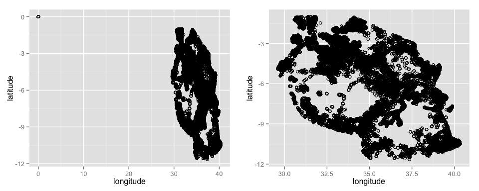

# Read the data and do some preprocessing.


Load useful R packages and the multiplot function from "Cookbook for R".


```r
source("myRsession.R")
```

I assume that NA, the empty string and the word "unknown" indicate missing values. Most (all?) 0s seem to indicate missing values as well. There are 40 predictors; it is feasible to specify the class of each column explicitly.


```r
na.strings = c(NA,"","unknown","Unknown")
colClasses = c("integer","numeric","Date","character","numeric","character",
               "numeric","numeric","character","integer","character","character",
               "character","character","character","character","character","numeric",
               "logical","character","character","character","logical","integer",
               "character","character","character","character","character","character",
               "character","character","character","character","character","character",
               "character","character","character","character")

train.labels = tbl_dt(fread("data/Training set labels.csv",
                            na.strings = na.strings,
                            colClasses = c("integer","character")))
train.values = tbl_dt(fread("data/Training set values.csv",
                            na.strings = na.strings,
                            colClasses = colClasses))
test.values = tbl_dt(fread("data/Test set values.csv",
                           na.strings = na.strings,
                           colClasses = colClasses))
```

For feature engineering, I transform the training and the test sets together, so I combine them into `data`. I add the column `subset`, so that I can split the data later on.


```r
train.values$subset = "train"
test.values$subset = "test"
train = inner_join(train.labels, train.values, by = "id")
data = tbl_df(rbind.fill(train,test.values))
```

A value of 0 does not make sense for the following predictors: `funder`, `installer`, `gps_height`, `population`, `construction_year`, and possibly, `amount_tsh`. It is hard to decide without knowing what tsh stands for.


```r
data = data %>%
  mutate(funder = ifelse(funder == 0, NA, funder)) %>%
  mutate(installer = ifelse(installer == 0, NA, installer)) %>%
  mutate(gps_height = ifelse(gps_height == 0, NA, gps_height)) %>%
  mutate(population = ifelse(population == 0, NA, population)) %>%
  mutate(amount_tsh = ifelse(amount_tsh == 0, NA, amount_tsh)) %>%
  mutate(construction_year = ifelse(construction_year == 0, NA, construction_year))
```

Latitude ranges in [-11.65,-2e-08] and longitude ranges in [0.0,40.35]. The scatter plot suggests that 0s indicate the coordinates are missing.


```r
p1 = ggplot(data, aes(x = longitude, y = latitude)) + geom_point(shape = 1)
data = data %>%
  mutate(latitude = ifelse(latitude > -1e-06, NA, latitude)) %>%
  mutate(longitude = ifelse(longitude < 1e-06, NA, longitude))
p2 = ggplot(data, aes(x = longitude, y = latitude)) + geom_point(shape = 1)
multiplot(p1, p2, cols = 2)
```

 

For every categorical response, convert the levels to lower case, in case there is random capitalization.


```r
chr.cols = data %>% summarise_each(funs(is.character(.))) %>%
  unlist() %>% which() %>% names()
data = data %>% mutate_each( funs(tolower), one_of(chr.cols))
```

Finally, `recorded_by` takes a single value [we can count the unique values in vector `x` with `n_distinct(x)`], and so it cannot help to differentiate between the three status groups.


```r
data = data %>% select( - recorded_by )
```

